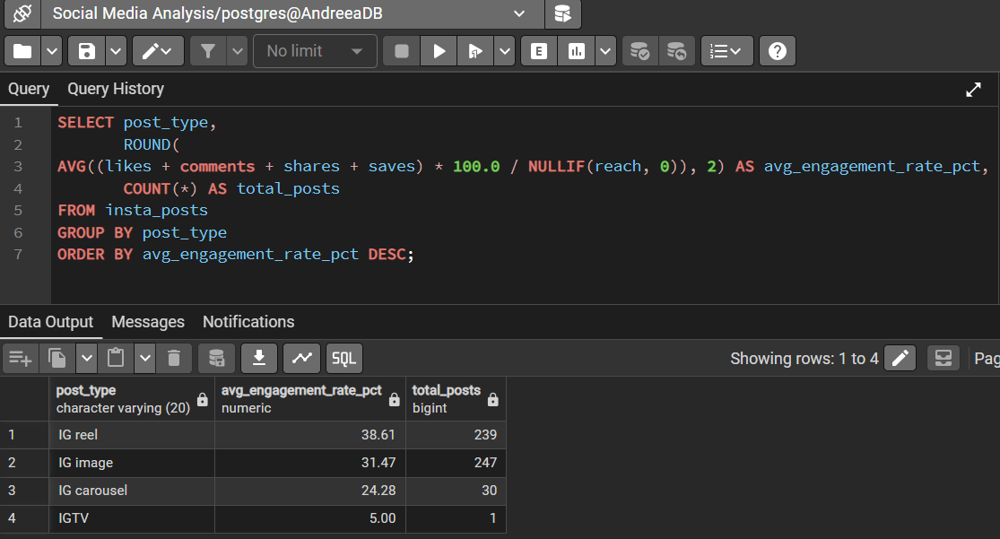
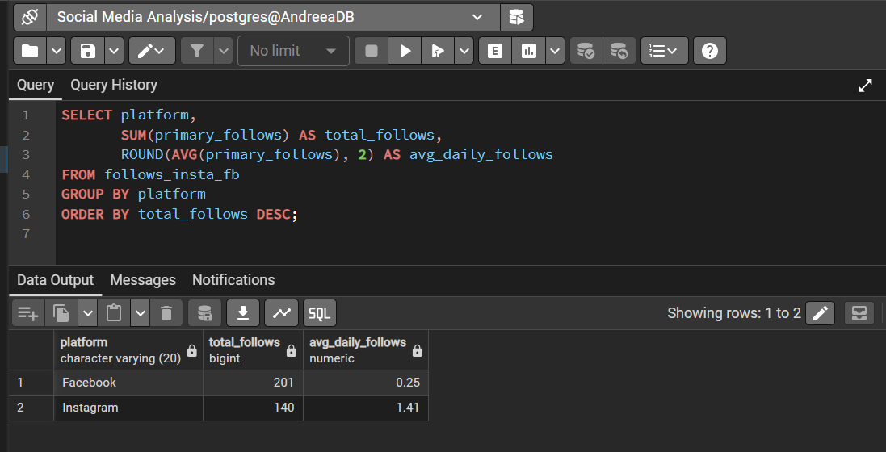

📊 Social Media Performance Analysis — Hair Studio (Facebook & Instagram)
A SQL-based data analysis project examining 2 years of real Facebook and Instagram data for a hair studio in Romania. Built with PostgreSQL, this project uncovers content performance patterns, audience growth trends, engagement insights, and platform-specific behaviour to help the business make smarter social media decisions.
---
🗂️ Project Overview
Detail	Info
Client	Real hair studio, Romania (anonymised)
Data Period	2 years of historical social media data
Platforms	Facebook & Instagram
Database	PostgreSQL (via PgAdmin)
Tools Used	PostgreSQL, PgAdmin, Microsoft Excel, Canva
Query Count	64 curated SQL queries across 10 analysis sections
---
🔍 Analysis Sections
The project is organised into 10 thematic sections, each addressing a key business question:
Content Performance — Which post types and topics drive the most results?
Best Time to Post — When is the audience most active and receptive?
Follower Growth — How and when does the audience grow?
Reach Analysis — How far does content travel beyond existing followers?
Engagement Analysis — How does the audience interact with content?
Stories Performance — How do Stories compare to feed posts?
Trends — What seasonal and long-term patterns exist?
Monetization Insights — Which content types best support business goals?
Top & Bottom Performers — What are the best and worst performing posts?
Cross-Platform Comparison — How does Facebook performance compare to Instagram?
---
## 💡 Key Findings

### 📈 Instagram Performance Improving Significantly
Instagram reach grew 37% from 2024 to 2025 while engagement rate increased 232% (17.31% to 57.4%) — achieved with fewer posts, indicating a clear improvement in content quality and strategy.

### 📉 Facebook Engagement Declined Sharply in 2025
Facebook engagement dropped from 34.41% to 4.44% in 2025 despite consistent posting. Organic reach also decreased 13%. This suggests algorithm changes impacted the account significantly and warrants a content strategy review.

### 🎥 Reels Generate Highest Engagement on Instagram
Reels achieve 38.61% average engagement rate, outperforming images (31.47%) and carousels (24.28%) based on 516 posts.

### 👥 Instagram Growing 5.6x Faster Daily Than Facebook
Instagram acquires new followers at 1.41/day vs Facebook's 0.25/day — making Instagram the priority platform for audience growth investment.

### ⏰ Posting Time Needs Further Testing
Most content was published at 13:00 (201 posts, 113 avg reach). Evening hours (17:00-19:00) show higher reach averages but insufficient data to confirm reliability. Systematic evening posting is recommended to validate.
## 📸 Query Results

### Engagement Rate by Post Type — Instagram


### Best Hour to Post — Instagram


### Platform Growth Comparison


### 2024 vs 2025 Performance Comparison

---
📁 Repository Structure
```
Hair-studio-social-media-analysis/
│
├── 01_content_performance.sql
├── 02_content_performance.sql
├── 03_best_time_to_post.sql
├── 04_best_time_to_post.sql
├── 05_audience_follower_growth.sql
├── 06_audience_follower_growth.sql
├── 07_audience_follower_growth.sql
├── 08_reach_and_visibility.sql
├── 09_reach_and_visibility.sql
├── 10_engagement_deep_dive.sql
├── 11_trends_over_time.sql
├── 12_trends_over_time.sql
├── 13_top_and_bottom_performers.sql
├── 14_cross_platform_comparison.sql
├── 15_cross_platform_comparison.sql
├── .gitignore
└── README.md
```
> ⚠️ **Note on Data Privacy:** Raw client data is not included in this repository out of respect for client confidentiality. The analysis was performed on real data exported from Meta Business Suite and prepared in Excel before being imported into PostgreSQL.
---
🧰 Tools & Technologies
Tool	Purpose
PostgreSQL	Database engine for all queries
PgAdmin 4	Query editor and database management
Microsoft Excel	Data cleaning and preparation before import
Canva	Business presentation of key insights
Git & GitHub	Version control and project sharing
---
👤 About This Project
This project was completed as part of my journey into Data Analytics. It represents my first end-to-end analysis project using real-world client data — from raw data preparation in Excel, through SQL analysis in PostgreSQL, to communicating findings in a business presentation.
The goal was not only to practise SQL skills but to produce genuinely useful insights that the studio owner can act on.
---
📬 Contact
Feel free to connect with me on LinkedIn or reach out if you have questions about this project.
LinkedIn: https://www.linkedin.com/in/andreea-melinte-0349707a/
---
Data used with client permission. All personally identifiable information has been removed.
