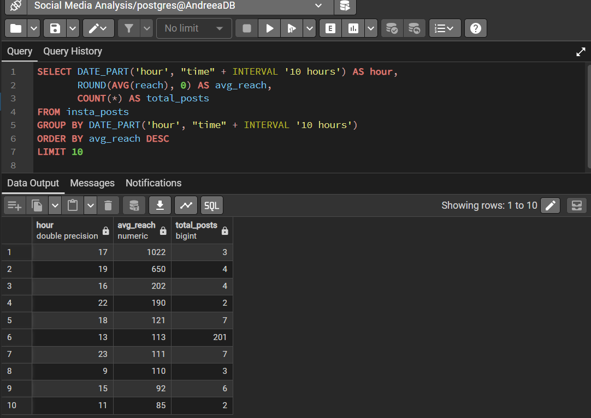
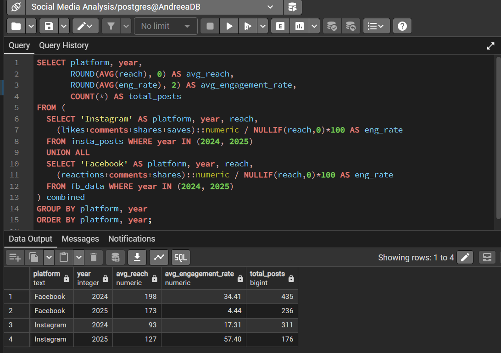

📊 Social Media Performance Analysis — Hair Studio (Facebook & Instagram)
A SQL-based data analysis project examining 2 years of real Facebook and Instagram data for a hair studio in Romania. Built with PostgreSQL, this project uncovers content performance patterns, audience growth trends, engagement insights, and platform-specific behaviour to help the business make smarter social media decisions.
---
🗂️ Project Overview
Detail	Info
Client	Real hair studio, Romania (anonymised)
Data Period	2 years of historical social media data
Platforms	Facebook & Instagram
Database	PostgreSQL (via PgAdmin)
Tools Used	PostgreSQL, PgAdmin, Microsoft Excel, Canva
Query Count	64 curated SQL queries across 10 analysis sections
---
🔍 Analysis Sections
The project is organised into 10 thematic sections, each addressing a key business question:
Content Performance — Which post types and topics drive the most results?
Best Time to Post — When is the audience most active and receptive?
Follower Growth — How and when does the audience grow?
Reach Analysis — How far does content travel beyond existing followers?
Engagement Analysis — How does the audience interact with content?
Stories Performance — How do Stories compare to feed posts?
Trends — What seasonal and long-term patterns exist?
Monetization Insights — Which content types best support business goals?
Top & Bottom Performers — What are the best and worst performing posts?
Cross-Platform Comparison — How does Facebook performance compare to Instagram?
---
## 💡 Key Findings

### 📈 Instagram Performance Improved Significantly in 2025
Instagram reach grew 37% (93 → 127 avg per post) while engagement
rate increased 232% (17.31% → 57.4%) — achieved with fewer posts,
indicating a clear improvement in content quality and strategy.

### 📉 Facebook Engagement Declined Sharply in 2025
Facebook engagement dropped from 34.41% to 4.44% in 2025 despite
consistent posting. Organic reach also decreased 13% (198 → 173).
This suggests algorithm changes impacted the account significantly
and warrants a content strategy review.

### 🎥 Reels Outperform All Other Content Formats
Reels achieve the highest engagement rate at 38.61%, outperforming
images (31.47%) and carousels (24.28%) — based on 516 posts analysed.

### 👥 Instagram Growing 5.6x Faster Daily Than Facebook
Instagram acquires new followers at 1.41/day vs Facebook's 0.25/day,
making Instagram the priority platform for audience growth investment.

### ⏰ Posting Time Needs Further Testing
Most content was published at 13:00 (201 posts, 113 avg reach).
Evening hours show higher averages but insufficient data to confirm.
Systematic evening posting is recommended to validate this pattern.
---
## 📸 Query Results

### Engagement Rate by Post Type — Instagram

*Reels achieve 38.61% avg engagement rate vs 31.47% for images
and 24.28% for carousels — based on 516 posts*

### Best Hour to Post — Instagram

*Most posts published at 13:00 (201 posts). Evening hours show
higher averages but need more data to confirm reliability*

### Platform Growth Comparison

*Instagram grows 5.6x faster daily than Facebook
(1.41 vs 0.25 avg daily follows)*

### 2024 vs 2025 Performance Comparison

*Instagram engagement grew 232% YoY while Facebook
engagement declined 87% in the same period*
---
## 📁 Repository Structure

├── 01_content_performance/
│   ├── Q07_engagement_rate_by_post_type_instagram.sql ⭐
│   └── Q08_engagement_rate_by_post_type_facebook.sql ⭐
├── 02_best_time_to_post/
│   ├── Q09_best_hour_by_reach_instagram.sql ⭐
│   ├── Q12_best_day_by_engagement_facebook.sql ⭐
│   └── Q12B_best_hour_and_day_combined_instagram.sql ⭐
├── 03_follower_growth/
│   ├── Q16_monthly_follower_growth_combined.sql ⭐
│   ├── Q17_platform_growth_comparison.sql ⭐
│   ├── Q21_posting_frequency_vs_follower_growth.sql ⭐
│   └── Q16_17_monthly_follower_growth_by_platform.sql ⭐
├── 04_reach_and_visibility/
│   ├── Q22_total_reach_per_month_both_platforms.sql ⭐
│   └── Q26_organic_vs_boosted_reach_facebook.sql ⭐
├── 05_engagement_deep_dive/
│   └── Q30_high_reach_low_engagement_instagram.sql ⭐
├── 06_trends_over_time/
│   ├── Q42_monthly_reach_trend_instagram.sql ⭐
│   └── Q47_2024_vs_2025_performance_comparison.sql ⭐
├── 07_top_bottom_performers/
│   └── Q52_top10_posts_by_reach_instagram.sql ⭐
├── 08_cross_platform/
│   ├── Q58_overall_engagement_rate_by_platform.sql ⭐
│   └── Q62_follows_to_reach_ratio_by_platform.sql ⭐
├── screenshots/
├── .gitignore
└── README.md

⭐ = Portfolio queries — highest business impact
📊 17 curated portfolio queries from a complete analysis of 64 SQL queries
```
> ⚠️ **Note on Data Privacy:** Raw client data is not included in this repository out of respect for client confidentiality. The analysis was performed on real data exported from Meta Business Suite and prepared in Excel before being imported into PostgreSQL.
---
🧰 Tools & Technologies
Tool	Purpose
PostgreSQL	Database engine for all queries
PgAdmin 4	Query editor and database management
Microsoft Excel	Data cleaning and preparation before import
Canva	Business presentation of key insights
Git & GitHub	Version control and project sharing
---
👤 About This Project
This project was completed as part of my journey into Data Analytics. It represents my first end-to-end analysis project using real-world client data — from raw data preparation in Excel, through SQL analysis in PostgreSQL, to communicating findings in a business presentation.
The goal was not only to practise SQL skills but to produce genuinely useful insights that the studio owner can act on.
---
📬 Contact
Feel free to connect with me on LinkedIn or reach out if you have questions about this project.
LinkedIn: https://www.linkedin.com/in/andreea-melinte-0349707a/
---
Data used with client permission. All personally identifiable information has been removed.
